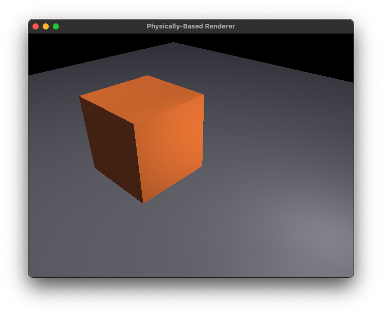
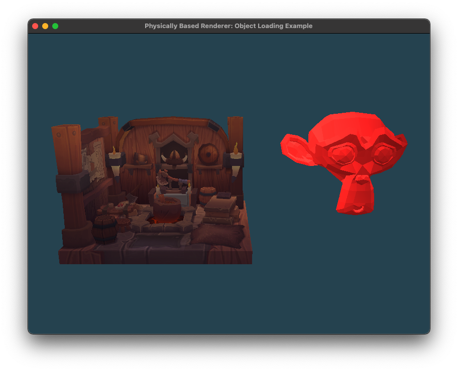

# PhysicallyBasedRenderer

A physically-based renderer I'm working on, using C++ and OpenGL. Check back soon for updates!

## Screenshots

(Currently I've only implemented Phong shading)

## CMake targets
- The library `PBR`
- Two example applications, `CubesWithSkybox` and `ObjectLoading`, demonstrating features and the API of the renderer. Both of these targets link in `PBR` as a private dependency.

## Build Dependencies (vcpkg)

- `boost-functional`
- `glfw3`
- `glm`
- `opengl`
- `stb`
- `tinyobjloader`
