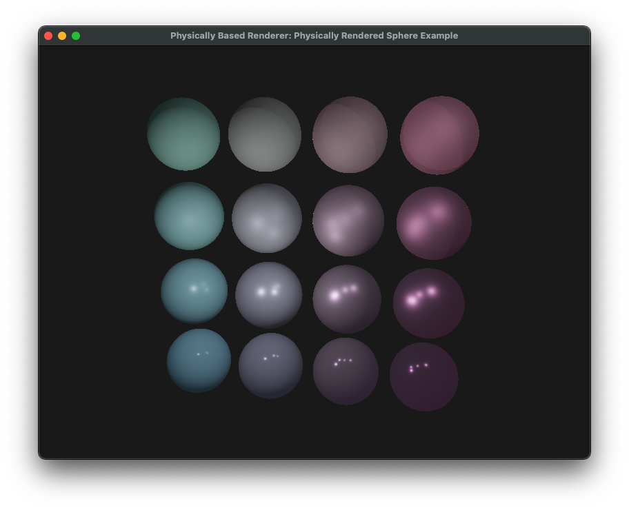
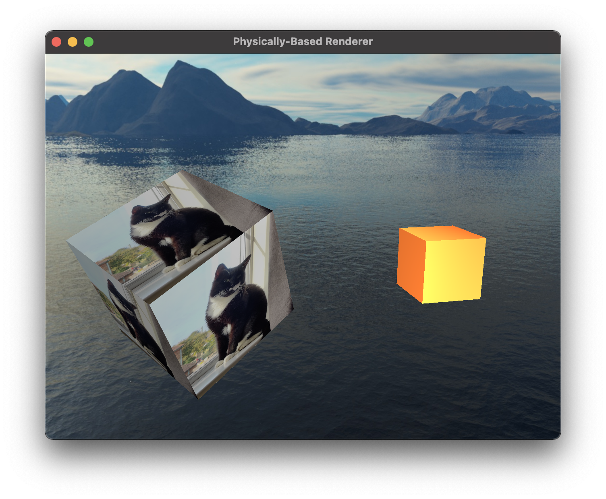
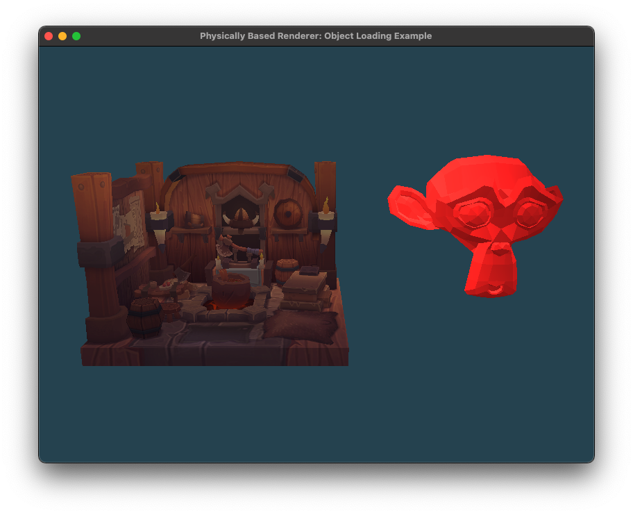

# PhysicallyBasedRenderer

A physically-based renderer I'm working on, using C++ and OpenGL. The renderer has two modes of operation: Phong rendering and physically based rendering, which attempts to model materials and light using physically-accurate properties.

The project is still under development, so check back soon for updates!

## Screenshots [Physically Based Mode]

From left-to-right the spheres become more metallic, and from bottom-to-top they become rougher.

## Screenshots [Phong Mode]

## CMake targets
- The core library `PBR`.
- Two example applications demonstrating the library's Phong rendering mode, `CubesWithSkybox` and `ObjectLoading`.
- A physically-based example, `PhysicallyRenderedSpheres`.

All examples privately link against the core library. The library includes functions for creating a window, setting up a scene, managing the camera and running the application's main loop.

## Build Dependencies (vcpkg)

- `boost-functional`
- `glfw3`
- `glm`
- `opengl`
- `stb`
- `tinyobjloader`
