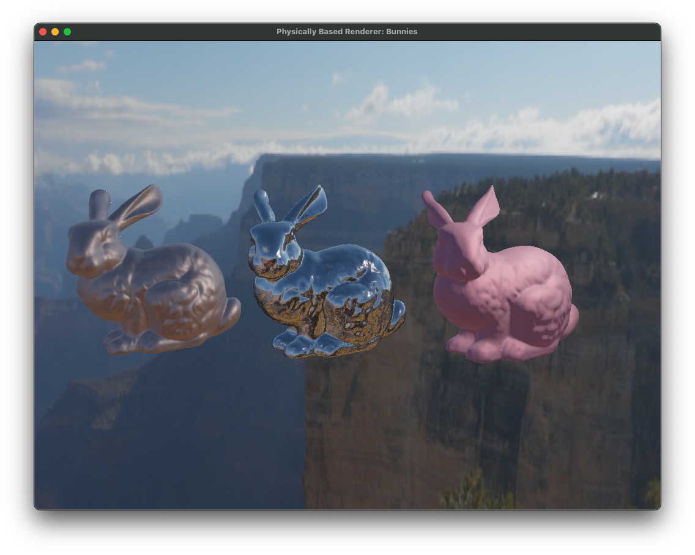

# PhysicallyBasedRenderer

A physically-based renderer I'm working on, using C++ and OpenGL. The renderer has two modes of operation: Phong rendering and physically based rendering, which attempts to model materials and light using physically-accurate properties.

## Screenshots



## CMake targets
**VERY IMPORTANT**: You must run all binaries from the *root directory* (the same directory that the README file you're currently reading is in). If not, the binaries will not be able to find the required shaders, textures and models.

You can build the targets like any other CMake application:
```bash
# Assuming you're in the root directory
mkdir build
cd build
cmake -DCMAKE_BUILD_TYPE=Debug -DCMAKE_TOOLCHAIN_FILE=/path/to/your/vcpkg.cmake -G Ninja ..  # or whatever build tool you prefer
cmake --build .
cd ../  # VERY IMPORTANT!
./build/example/PhysicallyRenderedSpheres  # for example
```

### Libraries
- The core library `PBR`, against which all other targets link.

### Executables (Phong)
- `CubesWithSkybox`
- `ObjectLoading`

### Executables (Physically-Based)
- `PhysicallyRenderedSpheres`, rendering spheres at different roughness levels
- `DifferentMaterialBunnies`, containing the copper, silver and plastic Stanford bunnies
- `SpheresDifferentBRDFs`, showing the spheres that use different BRDFs

All examples privately link against the core library. The library includes functions for creating a window, setting up a scene, managing the camera and running the application's main loop.

## Build Dependencies (vcpkg)

- `boost-functional`
- `glew`
- `glfw3`
- `glm`
- `opengl` (this might be preinstalled for you)
- `stb`
- `tinyobjloader`
